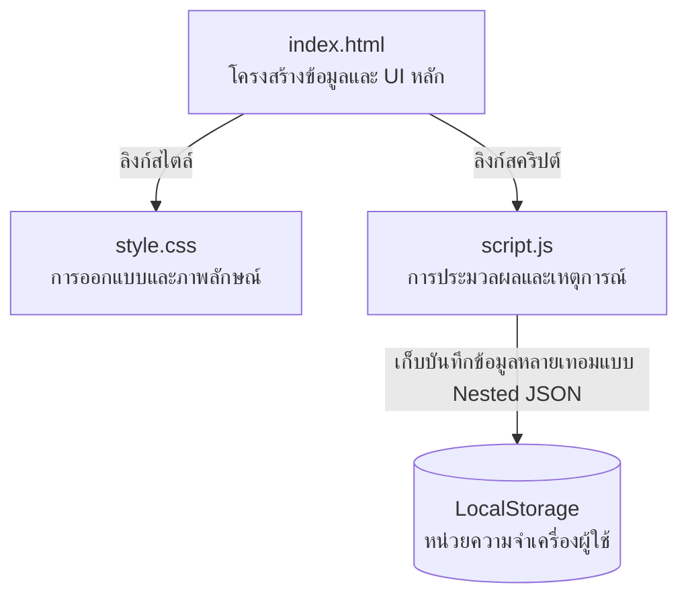

# 🎓 เครื่องคำนวณเกรดสะสม (GPA & GPax Calculator)
> **เครื่องคำนวณเกรดเฉลี่ยรายเทอมและเกรดสะสมสะสมหลายเทอมแบบโต้ตอบเรียลไทม์ (Vanilla JS Edition)**  
> พัฒนาด้วยเทคโนโลยีเว็บพื้นฐานมาตรฐานระดับสูง ออกแบบในสไตล์ **Glassmorphism (กระจกฝ้าพรีเมียม)** สวยงาม ทันสมัย และตอบสนองต่อทุกอุปกรณ์ (Fully Responsive)

<div align="left">
  
  
  
  
</div>

---

## 🧑‍💻 ข้อมูลผู้พัฒนา & ข้อมูลโครงการ

| หัวข้อ | รายละเอียด |
| :--- | :--- |
| **ชื่อ-นามสกุล** | นาย นภัสกรพรรณ พรมช่วย |
| **รหัสนักศึกษา** | 671540005031-3 |
| **สาขาวิชา / คณะ** | สาขาวิศวกรรมคอมพิวเตอร์ (Computer Engineering) |
| **ลิงก์หน้าเว็บจริง (Pages)** | [👉 คลิกเพื่อใช้งานเครื่องคำนวณเกรดสะสม 🌐](https://naphatsakornphanpr-tech.github.io/-GPA-Calculator-/) |
| **ลิงก์ Repository** | [👉 ลิงก์ซอร์สโค้ดโครงการบน GitHub 🐙](https://github.com/naphatsakornphanpr-tech/-GPA-Calculator-) |

> [!NOTE]
> **คำอธิบายผลงาน (สำหรับส่งงานอาจารย์):**  
> เลือกพัฒนาโปรแกรมเครื่องคำนวณเกรดสะสม (GPA & GPax Calculator) ที่รองรับการบริหารจัดการหลายภาคเรียน โดยส่วนที่ยากที่สุดคือการออกแบบโครงสร้างเพื่อรักษาหลัก **Separation of Concerns** ตามมาตรฐานวิชาอย่างเคร่งครัด (แยกส่วนการทำงานโดยไม่มี inline style/event ใน HTML เลย) ร่วมกับการจัดโครงสร้างข้อมูลแบบอาเรย์ซ้อนอาเรย์ (Nested Array) เพื่อคำนวณเกรดเฉลี่ยรายเทอมแยกจากเกรดรวมสะสม (GPax) แบบเรียลไทม์ และเก็บข้อมูลอัตโนมัติด้วย LocalStorage

---

## ✨ ฟีเจอร์เด่นของระบบ (Key Features)

* 🏫 **Multi-Semester Management:** สามารถเพิ่มเทอมการศึกษาใหม่ได้อย่างอิสระ แยกคำนวณเกรดรายเทอม (GPA) และดูเกรดสะสมรวมทุกเทอม (GPax) ไปพร้อมกัน
* 🚀 **Dynamic Row & Card Actions:** เพิ่มหรือลบรายวิชา รวมถึงลบเทอมการศึกษาออกได้ทันที พร้อมแอนิเมชันที่สวยงามลื่นไหล
* 🧮 **Reactive Real-time Calculation:** คำนวณเกรดเฉลี่ยรายเทอมและเกรดสะสมรวม (GPax) อัตโนมัติทันทีที่มีการเปลี่ยนแปลง โดยไม่ต้องกดปุ่มคำนวณ
* 🎨 **Premium Aesthetics:** การออกแบบ UI ด้วยดีไซน์ Glassmorphic สีกรมท่า-ม่วง-ชมพูพรีเมียม สบายตา และจัดใหม่เมื่ออยู่บนมือถือ (Responsive Grid)
* 💾 **Browser Cache Storage (Nested JSON):** บันทึกข้อมูลเทอมและวิชาทั้งหมดในรูปแบบโครงสร้าง JSON ซับซ้อนลง LocalStorage ทำให้ปิดหน้าเว็บไปข้อมูลก็ไม่สูญหาย
* 🛡️ **Built-in Security & Migration:** มีฟังก์ชัน escapeHtml ป้องกัน XSS และรองรับการดึงข้อมูลเวอร์ชันเดี่ยวเก่าแปลงเป็นโครงสร้างเวอร์ชันใหม่โดยอัตโนมัติ

---

## 🗂️ โครงสร้างสถาปัตยกรรมของโปรเจกต์
โปรเจกต์นี้ได้รับการพัฒนาขึ้นโดยยึดหลัก **Separation of Concerns** เพื่อให้ง่ายต่อการบำรุงรักษาโค้ด:



*   **`index.html`** 📝: กำหนดโครงสร้างหน้าหลัก กล่องแสดงผลรวม และจุดแทรกการ์ดเทอมการศึกษา (ปราศจาก inline style และ inline event สิ้นเชิง)
*   **`style.css`** 🎨: ควบคุมการตกแต่งสไตล์การ์ดเทอมการศึกษา กล่องป้อนข้อมูล ปุ่มลบเทอม การจัดวางแบบ responsive และเมนูตัวเลือกใน Dark mode
*   **`script.js`** ⚙️: จัดการ Event Listeners, จัดการ DOM (สร้างและลบแถว/การ์ดเทอม), คำนวณสูตรคณิตศาสตร์ถ่วงน้ำหนักสะสม และบันทึกข้อมูล Nested Array

---

## 🧮 สูตรที่ใช้ในการประมวลผลเกรดสะสม (GPax Formula)

สูตรการคำนวณเกรดเฉลี่ยสะสมรวมทุกเทอม (GPax) ใช้หลักเกณฑ์ถ่วงน้ำหนักจากทุกรายวิชาที่ระบุเกรด:

$$GPax = \frac{\sum_{\text{ทุกเทอม}} (\text{หน่วยกิตของวิชานั้น} \times \text{คะแนนประจำเกรดของวิชานั้น})}{\sum_{\text{ทุกเทอม}} (\text{หน่วยกิตทั้งหมดของวิชาที่ระบุเกรด})}$$

### 📈 ตารางเทียบค่าเกรด (Grade Point Mapping)

| เกรด | คะแนนประจำเกรด | เกรด | คะแนนประจำเกรด |
| :---: | :---: | :---: | :---: |
| **A** | `4.0` | **C** | `2.0` |
| **B+** | `3.5` | **D+** | `1.5` |
| **B** | `3.0` | **D** | `1.0` |
| **C+** | `2.5` | **F** | `0.0` |

---

## 📖 โพยเก็งแนวคำถาม-คำตอบ สำหรับการสอบสัมภาษณ์ (Oral Exam Guide)

> [!TIP]
> **ถาม 1: คุณแยกหน้าที่การทำงาน (Separation of Concerns) ในโปรเจกต์นี้อย่างไร?**  
> * **ตอบ:** ผมแยกไฟล์งานเป็น 3 ไฟล์ชัดเจนครับ:
>   * `index.html` ทำหน้าที่เฉพาะโครงสร้างของหน้าหลักและจุดสำหรับนำการ์ดแต่ละเทอมมาแทรก (ไม่มี inline style/event ในแท็ก HTML เลย)
>   * `style.css` จัดการสไตล์และเอฟเฟกต์การแสดงผลทั้งหมด รวมถึงการจัดรูปแบบใหม่เมื่อรันบนมือถือ
>   * `script.js` ควบคุมการทำงานของหน้าเว็บทั้งหมด ตั้งแต่การสร้าง ลบ คำนวณรายเทอมและผลรวม ไปจนถึงการเก็บข้อมูลลงใน LocalStorage ของเบราว์เซอร์

> [!TIP]
> **ถาม 2: โครงสร้างข้อมูลในการจัดเก็บข้อมูล (Data Structure) และระบบ LocalStorage ทำงานอย่างไร?**  
> * **ตอบ:** ระบบใหม่จะเก็บข้อมูลเป็นโครงสร้างแบบ **Nested Array** (อาร์เรย์ซ้อนอาร์เรย์) ครับ โดนจัดเก็บไว้ใน LocalStorage คีย์ `gpa_calculator_semesters` ในรูปแบบ JSON string:
>   ```javascript
>   [
>     {
>       title: "ภาคเรียนที่ 1/2568",
>       courses: [ { name: "Math", credits: "3.0", grade: "A" }, ... ]
>     },
>     {
>       title: "ภาคเรียนที่ 2/2568",
>       courses: [ ... ]
>     }
>   ]
>   ```
>   การบันทึกเกิดขึ้นในฟังก์ชัน `saveToLocalStorage()` โดยดึงค่าตรงจากหน้าจอจริงมาเซฟทุกครั้งที่มีการพิมพ์หรือเปลี่ยนค่าอินพุต

> [!TIP]
> **ถาม 3: ฟังก์ชันการคำนวณ `calculateAll()` ทำงานอย่างไร?**  
> * **ตอบ:** ฟังก์ชันนี้จะทำหน้าที่ลูปผ่านการ์ดเทอมแต่ละใบเพื่อคำนวณค่าเฉพาะเทอม (หน่วยกิตรวมเทอม และ GPA เทอม) เพื่ออัปเดตสรุปท้ายการ์ดใบนั้นๆ พร้อมกันนี้จะสะสมหน่วยกิตและคะแนนคูณหน่วยกิตของทุกวิชาในทุกการ์ดเทอมมารวมกัน เพื่อหาเกรดเฉลี่ยสะสมรวมทุกเทอม (GPax) แสดงผลบนแดชบอร์ดหลักครับ

---

## 💾 ประวัติประวัติการบันทึกพัฒนาการ (Git Commit History)
โปรเจกต์นี้ได้รับการบันทึกแบ่งเป็นขั้นตอนเพื่อแสดงความคืบหน้าของงานจริงตามกติกา ดังนี้:

*   `65808e5` 🟢 **feat:** create index.html with structural semantic layout
*   `501f852` 🔵 **feat:** add style.css with premium glassmorphism dark-mode layout
*   `fd029e8` 🟣 **feat:** implement GPA calculation logic and add README exam guide
*   `bf3cfa2` 🟠 **fix:** resolve select dropdown contrast issue and add default CPE courses
*   `ff66859` 🔴 **docs:** update student profile in README
*   `410db20` 🟡 **docs:** add project explanation description for submission to README
*   `c5b0a1b` 🟤 **docs:** style README.md with premium graphics badges tables and diagrams
