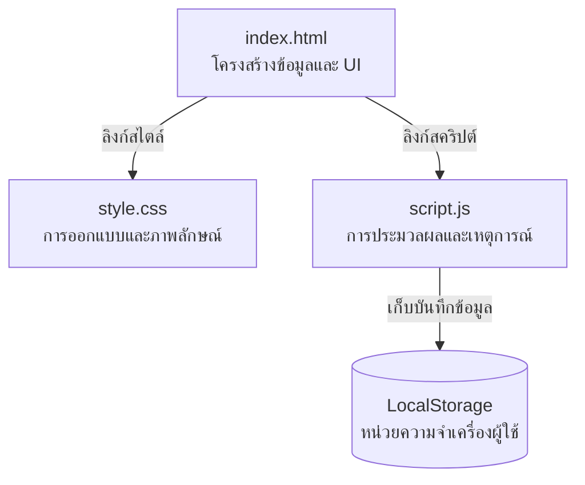

# 🎓 เครื่องคำนวณเกรดเฉลี่ย (GPA Calculator)
> **เครื่องคำนวณเกรดเฉลี่ยรายเทอมแบบโต้ตอบเรียลไทม์ (Vanilla JS Edition)**  
> พัฒนาด้วยเทคโนโลยีเว็บพื้นฐานมาตรฐานระดับสูง ออกแบบในสไตล์ **Glassmorphism (กระจกฝ้าพรีเมียม)** สวยงาม ทันสมัย และตอบสนองต่อทุกอุปกรณ์ (Fully Responsive)

  
  
  
  

---

## 🧑‍💻 ข้อมูลผู้พัฒนา & ข้อมูลโครงการ

| หัวข้อ | รายละเอียด |
| :--- | :--- |
| **ชื่อ-นามสกุล** | นาย นภัสกรพรรณ พรมช่วย |
| **รหัสนักศึกษา** | 671540005031-3 |
| **สาขาวิชา / คณะ** | สาขาวิศวกรรมคอมพิวเตอร์ (Computer Engineering) |
| **ลิงก์หน้าเว็บจริง (Pages)** | [👉 คลิกเพื่อใช้งานเครื่องคำนวณเกรดเฉลี่ย 🌐](https://naphatsakornphanpr-tech.github.io/-GPA-Calculator-/) |
| **ลิงก์ Repository** | [👉 ลิงก์ซอร์สโค้ดโครงการบน GitHub 🐙](https://github.com/naphatsakornphanpr-tech/-GPA-Calculator-) |

> [!NOTE]
> **คำอธิบายผลงาน (สำหรับส่งงานอาจารย์):**  
> เลือกพัฒนาโปรแกรมเครื่องคำนวณเกรดเฉลี่ย (GPA Calculator) ของเทอม โดยส่วนที่ยากที่สุดคือการออกแบบโครงสร้างเพื่อรักษาหลัก **Separation of Concerns** ตามมาตรฐานวิชาอย่างเคร่งครัด (แยกส่วนการทำงานโดยไม่มี inline style/event ใน HTML เลย) ร่วมกับการประมวลผลคำนวณเกรดแบบ Real-time และระบบบันทึกข้อมูลผู้ใช้งานอัตโนมัติ (LocalStorage) เพื่อเพิ่มประสบการณ์การใช้งานที่ราบรื่น

---

## ✨ ฟีเจอร์เด่นของระบบ (Key Features)

* 🚀 **Dynamic Row Addition/Deletion:** เพิ่มหรือลบรายวิชาได้อย่างไม่จำกัดผ่านปุ่มควบคุมที่ออกแบบอย่างลื่นไหล
* 🧮 **Reactive Real-time Calculation:** คำนวณเกรดเฉลี่ยสะสม (GPA) อัตโนมัติทันทีที่มีการเปลี่ยนแปลงค่า โดยไม่มีความจำเป็นต้องกดปุ่มคำนวณ
* 🎨 **Premium Aesthetics:** การออกแบบ UI ด้วยดีไซน์ Glassmorphic สีกรมท่า-ม่วง-ชมพูพรีเมียม สบายตา และมีแอนิเมชันที่นุ่มนวล
* 📱 **Fully Responsive Layout:** ปรับเปลี่ยนการจัดวางองค์ประกอบให้อัตโนมัติเมื่อใช้งานบนโทรศัพท์มือถือ เพื่อการกรอกข้อมูลที่สะดวก
* 💾 **Browser Cache Storage:** บันทึกข้อมูลวิชาเรียนไว้ในตัวบราวเซอร์ (LocalStorage) รีเฟรชหรือปิดแท็บไปข้อมูลก็ไม่สูญหาย
* 🛡️ **Built-in Security:** ป้องกันการโจมตีประเภท Cross-Site Scripting (XSS) ในกล่องป้อนข้อมูลวิชาเรียน

---

## 🗂️ โครงสร้างสถาปัตยกรรมของโปรเจกต์
โปรเจกต์นี้ได้รับการพัฒนาขึ้นโดยยึดหลัก **Separation of Concerns** เพื่อให้ง่ายต่อการบำรุงรักษาโค้ด:

*   **`index.html`** 📝: กำหนดโครงสร้างหน้าต่าง ข้อมูลเบื้องต้น และกล่องแสดงผล (ปราศจาก inline style และ inline event สิ้นเชิง)
*   **`style.css`** 🎨: ควบคุมการสไตล์ สีกระจกฝ้า แอนิเมชัน และการตอบสนองบนมือถือ (Responsive Grid)
*   **`script.js`** ⚙️: จัดการ Event Listeners, คำนวณสูตรคณิตศาสตร์, จัดการ DOM และจัดเก็บข้อมูลฝั่งไคลเอนต์

---

## 🧮 สูตรที่ใช้ในการประมวลผลเกรด (GPA Formula)

คำนวณแบบค่าเฉลี่ยถ่วงน้ำหนัก (Weighted Average Calculation):

$$GPA = \frac{\sum (\text{หน่วยกิตของวิชา} \times \text{คะแนนเกรดของวิชา})}{\text{ผลรวมหน่วยกิตทั้งหมดของวิชาที่กรอกเกรด}}$$

### 📈 ตารางเทียบค่าเกรด (Grade Point Mapping)

| เกรด | คะแนนสะสมที่ได้ | เกรด | คะแนนสะสมที่ได้ |
| :---: | :---: | :---: | :---: |
| **A** | `4.0` | **C** | `2.0` |
| **B+** | `3.5` | **D+** | `1.5` |
| **B** | `3.0` | **D** | `1.0` |
| **C+** | `2.5` | **F** | `0.0` |

---

## 📖 โพยเก็งแนวคำถาม-คำตอบ สำหรับการสอบสัมภาษณ์ (Oral Exam Guide)

> [!TIP]
> **ถาม 1: คุณแยกหน้าที่การทำงาน (Separation of Concerns) ในงานนี้อย่างไรบ้าง?**  
> * **ตอบ:** ผมได้แยกความรับผิดชอบของโปรแกรมเป็น 3 ไฟล์หลักอย่างเด็ดขาดครับ:
>   * `index.html` เก็บเพียงโครงสร้างข้อมูลดิบ ไม่มีคำสั่ง `style="..."` และไม่มี event handler เช่น `onclick` อยู่เลย
>   * `style.css` ทำหน้าที่แต่งความสวยงามและการตอบสนองต่อผู้ใช้งานทั้งหมด
>   * `script.js` ทำหน้าที่ผูกตัวดักเหตุการณ์ (`addEventListener`) และประมวลผลตรรกะในฟังก์ชันทั้งหมดหลังเว็บโหลดเสร็จ

> [!TIP]
> **ถาม 2: สูตรการคำนวณและฟังก์ชัน `calculateGPA()` ทำงานอย่างไรโดยย่อ?**  
> * **ตอบ:** ฟังก์ชันจะดึงแถวรายวิชาด้วยคำสั่ง `querySelectorAll('.course-row')` มาลูปเช็คค่า หากมีการระบุเกรด จะแปลงเกรดอักษรเป็นตัวเลขผ่านออบเจกต์ `GRADE_POINTS` จากนั้นหาผลรวมของ `(หน่วยกิต * คะแนนเกรด)` หารด้วย `ผลรวมหน่วยกิตทั้งหมด` และใช้คำสั่ง `.toFixed(2)` เพื่อปัดทศนิยมเป็น 2 ตำแหน่งไปแสดงผลบน UI ครับ

> [!TIP]
> **ถาม 3: ทำไมหน้าเว็บเครื่องคำนวณนี้สามารถเปิดใช้งานบน GitHub Pages ได้โดยไม่ต้องมี Backend Server?**  
> * **ตอบ:** เนื่องจากโปรเจกต์นี้เป็น **Static Web Application** ที่มีเพียงไฟล์ HTML, CSS, JS ซึ่งบราวเซอร์ของฝั่งผู้ใช้งาน (Client-side) เป็นผู้รันและประมวลผลโค้ดเองทั้งหมดครับ GitHub Pages จึงทำหน้าที่เป็นเว็บโฮสติ้งให้บริการไฟล์แบบ Static โดยตรงโดยไม่ต้องพึ่งพา Backend หรือดาต้าเบสฝั่งเซิร์ฟเวอร์

---

## 💾 ประวัติประวัติการบันทึกพัฒนาการ (Git Commit History)
โปรเจกต์นี้ได้รับการบันทึกแบ่งเป็นขั้นตอนเพื่อแสดงความคืบหน้าของงานจริงตามกติกา ดังนี้:

*   `65808e5` 🟢 **feat:** create index.html with structural semantic layout
*   `501f852` 🔵 **feat:** add style.css with premium glassmorphism dark-mode layout
*   `fd029e8` 🟣 **feat:** implement GPA calculation logic and add README exam guide
*   `bf3cfa2` 🟠 **fix:** resolve select dropdown contrast issue and add default CPE courses
*   `ff66859` 🔴 **docs:** update student profile in README
